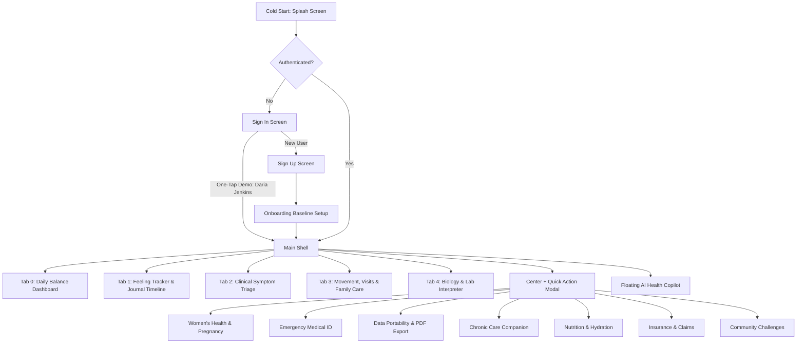

# Health Companion — Complete Features, UI Elements & Workflows Specification

> **Document Version**: 1.0.0  
> **Target Application**: Health Companion (Apple-Caliber Health & Wellness Platform)  
> **Platform**: Flutter Cross-Platform (Web, iOS, Android, macOS)  
> **Design Language**: Apple Luminous Glassmorphism with Frosted Backdrop Filters, Obsidian Stat Cards, and Editorial Typography.

---

## Table of Contents

1. [Application Architecture & Navigation Hierarchy](#1-application-architecture--navigation-hierarchy)
2. [Phase 1: Entry & Authentication](#2-phase-1-entry--authentication)
   - [2.1 Splash Screen](#21-splash-screen)
   - [2.2 Sign In Screen](#22-sign-in-screen)
   - [2.3 Sign Up / Create Account Screen](#23-sign-up--create-account-screen)
   - [2.4 Onboarding Baseline Health Setup Screen](#24-onboarding-baseline-health-setup-screen)
3. [Phase 2: Global Shell & Floating Navigation Dock](#3-phase-2-global-shell--floating-navigation-dock)
   - [3.1 Main Shell & Holographic Background](#31-main-shell--holographic-background)
   - [3.2 Frosted Glass Top App Bar](#32-frosted-glass-top-app-bar)
   - [3.3 5-Slot Floating Dock Navigation Bar](#33-5-slot-floating-dock-navigation-bar)
   - [3.4 Center Action (+) Quick Sheet](#34-center-action--quick-sheet)
   - [3.5 Omnipresent AI Health Copilot Sheet](#35-omnipresent-ai-health-copilot-sheet)
4. [Phase 3: Core Primary Tabs](#4-phase-3-core-primary-tabs)
   - [4.1 Tab 0: Daily Balance Dashboard (Home)](#41-tab-0-daily-balance-dashboard-home)
   - [4.2 Tab 1: Feeling Tracker & Reflections Timeline (Journal)](#42-tab-1-feeling-tracker--reflections-timeline-journal)
     - [4.2.1 Modal: Guided Reflection & Voice Journal Sheet](#421-modal-guided-reflection--voice-journal-sheet)
   - [4.3 Tab 2: Clinical Symptom Triage](#43-tab-2-clinical-symptom-triage)
   - [4.4 Tab 3: Movement, Consultations & Caregivers (Appointments)](#44-tab-3-movement-consultations--caregivers-appointments)
     - [4.4.1 Segment 0: Today's Movement & Universal Recovery Engine](#441-segment-0-todays-movement--universal-recovery-engine)
     - [4.4.2 Segment 1: Upcoming Consultations & Specialist Visits](#442-segment-1-upcoming-consultations--specialist-visits)
     - [4.4.3 Segment 2: Family Connect & Caregiver Circle](#443-segment-2-family-connect--caregiver-circle)
     - [4.4.4 Modal: Book Specialist Consultation](#444-modal-book-specialist-consultation)
     - [4.4.5 Modal: Add Dependent or Caregiver](#445-modal-add-dependent-or-caregiver)
   - [4.5 Tab 4: Biology & Lab Interpreter](#45-tab-4-biology--lab-interpreter)
     - [4.5.1 Modal: Upload Lab Report (Camera / Files)](#451-modal-upload-lab-report-camera--files)
     - [4.5.2 Modal: Doctor Discussion Questions](#452-modal-doctor-discussion-questions)
5. [Phase 4: Specialized Feature Modules & Modals](#5-phase-4-specialized-feature-modules--modals)
   - [5.1 Women's Health: Menstrual Cycle Tracking](#51-womens-health-menstrual-cycle-tracking)
     - [5.1.1 Modal: Period & Flow Intensity Logging](#511-modal-period--flow-intensity-logging)
   - [5.2 Women's Health: Pregnancy Mode Dashboard](#52-womens-health-pregnancy-mode-dashboard)
     - [5.2.1 Tool: Interactive 10-Kick Session Counter](#521-tool-interactive-10-kick-session-counter)
     - [5.2.2 Tool: Pregnancy Weight Gain Tracker](#522-tool-pregnancy-weight-gain-tracker)
     - [5.2.3 Vault: Prenatal Scans & Ultrasound Records](#523-vault-prenatal-scans--ultrasound-records)
   - [5.3 Emergency Medical ID & Fall Detection](#53-emergency-medical-id--fall-detection)
   - [5.4 Clinical Data Portability & PDF Export](#54-clinical-data-portability--pdf-export)
   - [5.5 Chronic Care Companion (Hypertension & Diabetes)](#55-chronic-care-companion-hypertension--diabetes)
   - [5.6 Nutrition & Hydration Tracker](#56-nutrition--hydration-tracker)
   - [5.7 Insurance Policies & Claims Adjudication](#57-insurance-policies--claims-adjudication)
   - [5.8 Community Challenges & Habit Streaks](#58-community-challenges--habit-streaks)
   - [5.9 Wearables Integration & Permissions](#59-wearables-integration--permissions)
6. [End-to-End User Flow Matrix](#6-end-to-end-user-flow-matrix)

---

## 1. Application Architecture & Navigation Hierarchy

The application runs on a reactive state model (`AppState`) backed by local encrypted persistence (`SharedPreferences`) and an isolated multi-tenant authentication engine (`AuthService`).

---

## 2. Phase 1: Entry & Authentication

### 2.1 Splash Screen
- **Component File**: [lib/features/splash/screens/splash_screen.dart](file:///Users/prakharjain/Documents/stitch_application_builder_workspace/lib/features/splash/screens/splash_screen.dart)
- **Trigger**: App cold start.
- **Visual Components & Outputs**:
  - Full-screen animated multi-layer mesh background (`#4A148C`, `#880E4F`, `#1A237E`).
  - Spring-scaled monogram logo shield with glowing aura (`Curves.elasticOut`).
  - Editorial tagline: *"Health Companion • Apple-Caliber Clinical Intelligence"*.
  - Indeterminate frosted progress indicator.
- **Interactive Controls**: None (automatic 1800ms timed lifecycle).
- **Inputs**: None.
- **Outputs / State Reaction**: Reads cached user session via `AppState.initializeAuth()`. If valid token exists, pushes `HealthCompanionShell`; otherwise, transitions to `SignInScreen`.
- **Workflow**: Launches on boot $\to$ checks stored user token $\to$ routes to authenticated home or sign-in gate.

---

### 2.2 Sign In Screen
- **Component File**: [lib/features/auth/screens/sign_in_screen.dart](file:///Users/prakharjain/Documents/stitch_application_builder_workspace/lib/features/auth/screens/sign_in_screen.dart)
- **Trigger**: Launch without session or explicit Sign Out.
- **Visual Components & Outputs**:
  - Frosted glass authentication card with Apple typography.
  - Brand header with stethoscope monogram icon.
  - Error banner (appears on incorrect credentials).
- **Interactive Controls**:
  - **Button**: *"Sign In"* (Primary elevated button).
  - **Button**: *"One-Tap Demo (Daria Jenkins)"* (Pre-populates clinical persona with pre-seeded biometrics, appointments, and lab panels).
  - **Button**: *"Create Account"* (Text button at bottom).
  - **Button**: Password visibility toggle eye icon.
- **Inputs**:
  - `Email Address` (Text input, email keyboard, auto-lowercase).
  - `Password` (Secure text input with obscure toggle).
- **Outputs / State Reaction**: Validates email/password against `AuthService`. On success, loads profile data, sets `isSignedIn = true`, and transitions into `HealthCompanionShell`.
- **Workflow**:
  1. **Demo Path**: Tap *"One-Tap Demo"* $\to$ bypasses typing $\to$ instantly logs in as Daria Jenkins $\to$ lands on Daily Balance.
  2. **Standard Path**: Enter email and password $\to$ tap *"Sign In"* $\to$ validates credentials $\to$ lands on dashboard.

---

### 2.3 Sign Up / Create Account Screen
- **Component File**: [lib/features/auth/screens/sign_up_screen.dart](file:///Users/prakharjain/Documents/stitch_application_builder_workspace/lib/features/auth/screens/sign_up_screen.dart)
- **Trigger**: Tapping *"Create Account"* from `SignInScreen`.
- **Visual Components & Outputs**:
  - Glass card with step progress subtitle *"Step 1 of 2 • Account Profile"*.
  - Editorial title: *"Begin your clinical wellness journey"*.
- **Interactive Controls**:
  - **Button**: *"Continue to Baseline Setup"* (Primary action).
  - **Button**: *"Already have an account? Sign In"* (Back to login).
- **Inputs**:
  - `Full Legal Name` (Capitalized text field).
  - `Email Address` (Email validation).
  - `Password` (Minimum 6 characters requirement).
  - `Confirm Password` (Exact match validation).
- **Outputs / State Reaction**: Creates new isolated tenant in `AuthService`, seeds initial empty profile, transitions to `OnboardingBaselineScreen`.
- **Workflow**: Fill name, email, password $\to$ tap *"Continue"* $\to$ account created $\to$ routes to Step 2 Baseline Onboarding.

---

### 2.4 Onboarding Baseline Health Setup Screen
- **Component File**: [lib/features/onboarding/screens/onboarding_baseline_screen.dart](file:///Users/prakharjain/Documents/stitch_application_builder_workspace/lib/features/onboarding/screens/onboarding_baseline_screen.dart)
- **Trigger**: Immediately follows Account Creation or opened via Quick Action *"Update Baseline Health Data"*.
- **Visual Components & Outputs**:
  - Progress pill: *"Step 2 of 2 • Baseline Setup"*.
  - Headline: *"Establish your clinical baseline"*.
  - Lab upload card with status badge (Pending / Uploaded).
  - Body metrics card with dual number inputs.
  - Private Progress Photo card with AES-256 On-Device Encryption green badge.
- **Interactive Controls**:
  - **Button**: *"Skip for now"* (Top right header action).
  - **Button**: *"Upload Recent PDF / Camera Scan"* (Opens `UploadReportModal`).
  - **Button**: *"Take Photo"* (Camera trigger for progress photo).
  - **Button**: *"Gallery"* (Image picker trigger).
  - **Button**: *"Save Baseline & Enter Dashboard"* (Primary CTA).
- **Inputs**:
  - `Height (cm)`: Numeric text input (e.g. `172`).
  - `Weight (kg)`: Decimal numeric text input (e.g. `65.0`).
  - `Progress Photo`: File path from camera/gallery.
  - `Recent Lab Report`: Ingested document payload.
- **Outputs / State Reaction**: Updates `appState.userHeightCm`, `userWeightKg`, recalculates baseline BMI, saves photo path to sandboxed device storage, marks `isOnboardingBaselineCompleted = true`, and navigates to `HealthCompanionShell`.
- **Workflow**: Enter height/weight $\to$ optionally upload lab or take photo $\to$ tap *"Save Baseline"* $\to$ personalized Daily Balance loads.

---

## 3. Phase 2: Global Shell & Floating Navigation Dock

### 3.1 Main Shell & Holographic Background
- **Component File**: [lib/main.dart](file:///Users/prakharjain/Documents/stitch_application_builder_workspace/lib/main.dart) & [lib/core/widgets/holographic_background.dart](file:///Users/prakharjain/Documents/stitch_application_builder_workspace/lib/core/widgets/holographic_background.dart)
- **Visual Components & Outputs**: Multi-layer ambient shifting pastel gradient canvas (`#FAF6FC`, `#FDF1F5`, `#EDEAFE`). Houses the active screen inside an `AnimatedSwitcher` with sequential z-indexed transition curves eliminating ghosting.
- **Outputs / State Reaction**: Renders active tab based on `appState.selectedTabIndex`.

---

### 3.2 Frosted Glass Top App Bar
- **Component File**: [lib/core/widgets/glass_app_bar.dart](file:///Users/prakharjain/Documents/stitch_application_builder_workspace/lib/core/widgets/glass_app_bar.dart)
- **Visual Components & Outputs**:
  - Circular avatar with online status indicator.
  - Greeting text: *"Good morning/afternoon, [User First Name]"*.
  - Date subtitle: *"Today, [Month Day]"*.
  - Wearable Bluetooth sync indicator badge (Green dot when connected).
- **Interactive Controls**:
  - **Avatar Tap**: Opens profile and Sign Out confirmation dialog.
  - **Sparkle Icon Button**: Opens the AI Health Copilot sheet.
  - **Notification Bell Icon**: Displays quick notification sheet with latest lab and appointment alerts.
- **Outputs / State Reaction**: Switches screens or triggers contextual modals.

---

### 3.3 5-Slot Floating Dock Navigation Bar
- **Component File**: [lib/core/widgets/floating_bottom_nav.dart](file:///Users/prakharjain/Documents/stitch_application_builder_workspace/lib/core/widgets/floating_bottom_nav.dart)
- **Visual Components & Outputs**:
  - 5 frosted squircle slots suspended above the screen with continuous curvature.
  - Slot 0: **Daily Balance** (Home icon).
  - Slot 1: **Journal** (Mood smiling face icon).
  - Slot 2 (Elevated Center): **Quick Action (+)** with glowing radial accent.
  - Slot 3: **Fitness & Visits** (Calendar & runner icon).
  - Slot 4: **Labs** (Biomarker test flask icon).
- **Interactive Controls**:
  - Tap on any of Slots 0, 1, 3, 4: Switches active tab with haptic feedback.
  - Tap on Slot 2 (+): Opens `QuickActionSheet`.
- **Outputs / State Reaction**: Triggers `appState.setTabIndex(index)`.

---

### 3.4 Center Action (+) Quick Sheet
- **Component File**: [lib/core/widgets/quick_action_sheet.dart](file:///Users/prakharjain/Documents/stitch_application_builder_workspace/lib/core/widgets/quick_action_sheet.dart)
- **Trigger**: Tapping center `+` button on dock.
- **Visual Components & Outputs**: Frosted bottom sheet modal with 9 fast-access health actions.
- **Interactive Buttons**:
  1. *"Log Today's Feeling"*: Jumps to Journal and opens `JournalEntrySheet`.
  2. *"Ask AI Health Copilot"*: Opens `AiChatSheet`.
  3. *"Upload Lab Document"*: Opens `UploadReportModal`.
  4. *"Book Doctor Consultation"*: Opens `BookAppointmentModal`.
  5. *"Today's Movement & Recovery"*: Switches to Movement panel.
  6. *"Women's Health & Pregnancy"*: Opens `WomensHealthScreen`.
  7. *"Sync Apple Watch / Wearable"*: Simulates telemetry sync and updates vitals.
  8. *"Update Baseline Health Data"*: Opens `OnboardingBaselineScreen`.
  9. *"Switch Language (English / हिंदी)"*: Toggles bilingual interface mode.
- **Outputs / State Reaction**: Instantly launches requested workflow or updates global state.

---

### 3.5 Omnipresent AI Health Copilot Sheet
- **Component File**: [lib/features/ai_assistant/widgets/ai_chat_sheet.dart](file:///Users/prakharjain/Documents/stitch_application_builder_workspace/lib/features/ai_assistant/widgets/ai_chat_sheet.dart)
- **Trigger**: Tapping floating sparkle button or App Bar AI icon.
- **Visual Components & Outputs**:
  - Chat stream with message bubbles (User vs AI).
  - Contextual quick-prompt chips tailored to current screen (e.g., *"Explain my ALT result"*, *"What does 78 balance score mean?"*, *"Prepare for Dr. Sharma visit"*).
  - Interactive deep-link pills inside AI answers (e.g. *"View Lab Report"*, *"Book Specialist"*).
  - Indeterminate typing indicator.
- **Interactive Controls**:
  - **Quick Prompt Chips**: One-tap query submission.
  - **Send Arrow Button**: Submits custom user query.
  - **Deep-Link Navigation Buttons**: Jumps directly to relevant tab.
- **Inputs**:
  - Text input field: *"Ask anything about your health, vitals, or labs..."*.
- **Outputs / State Reaction**: Calls `AiCopilotService.processQuery()`, executes clinical rules against live state (vitals, appointments, prescriptions, biomarkers), and renders formatted clinical advice with disclaimers.

---

## 4. Phase 3: Core Primary Tabs

### 4.1 Tab 0: Daily Balance Dashboard (Home)
- **Component File**: [lib/features/home/screens/home_screen.dart](file:///Users/prakharjain/Documents/stitch_application_builder_workspace/lib/features/home/screens/home_screen.dart)
- **Visual Components & Outputs**:
  - **Top Weather & Activity Dual Pills**: Pill 1 (*"Active ⌵"*), Pill 2 (*"30 °C Hot & Sunny"* with sun icon).
  - **Aurora Tip Pill**: *"Today's balance score is optimal • 78/100"*.
  - **Semi-Circular Balance Gauge**: Custom-painted gradient arc gauge displaying `78` in center with *"Good balance"* subtitle.
  - **Physiological Stress Sparkline Card**: Horizontal card showing real-time stress levels (`36/6/11` - Normal/Mild/Elevated) with mini line chart.
  - **Apple Watch-Face Obsidian Vitals Grid**:
    - *Heart Rate Tile*: `72 BPM` with radiant rose glow (`#FF5252`) and resting status.
    - *Sleep Tile*: `7h 10m` with indigo aura (`#5C6BC0`) and 88% sleep performance.
    - *Steps Tile*: `8,420` with emerald glow (`#00E676`) and goal ring.
    - *Blood Oxygen Tile*: `98%` with cyan glow (`#00E5FF`) and normal oxygenation status.
  - **Clinical Preventive Care Alert Banner**: USPSTF guideline recommendation (e.g. *"Comprehensive Metabolic Panel due"* with *"Schedule"* action).
  - **Interactive Today's Medications Checklist**: List of daily prescriptions with dosage, frequency, and interactive checkbox.
- **Interactive Controls**:
  - **Balance Gauge Tap**: Navigates to Feeling Journal.
  - **Vitals Tile Tap**: Opens wearable details and permission info.
  - **Medication Checkbox**: Taps checkbox $\to$ triggers animated strikethrough and saves completion timestamp.
  - **Preventive Banner "Schedule" Button**: Opens appointment booking sheet.
- **Outputs / State Reaction**: Updates daily adherence percentage in `AppState`.

---

### 4.2 Tab 1: Feeling Tracker & Reflections Timeline (Journal)
- **Component File**: [lib/features/journal/screens/journal_feeling_screen.dart](file:///Users/prakharjain/Documents/stitch_application_builder_workspace/lib/features/journal/screens/journal_feeling_screen.dart)
- **Visual Components & Outputs**:
  - **7-Day Horizontal Calendar Strip**: Day abbreviations and numbers (e.g. *Tu 03, We 04, Th 05...*) with active selection indicator and period flow dots.
  - **Editorial Headline**: *"How are you feeling today?"* with description *"Feeling tracker helps to analyse your state on mind"*.
  - **Curved Mood Dial Arc**: Interactive semi-circular arc with radiating tick marks and 6 glowing mood nodes:
    1. *Sleepy* (Indigo `#818CF8`)
    2. *Relaxed* (Emerald `#34D399`)
    3. *Calm* (Sky Blue `#38BDF8`)
    4. *Energetic* (Purple `#6E5DF6`)
    5. *Focused* (Violet `#A855F7`)
    6. *Radiant* (Rose Coral `#FB7185`)
  - **Dynamic Mood Badge**: Displays active title, icon, and description.
  - **Circular Step Button**: Dark circle with `→` arrow and counter *"4 of 8"*.
  - **Action Buttons**: *"New Reflection"* (Pill button) and *"AI Insights"* (Frosted button).
  - **Health Correlations Section**: 3 correlation cards:
    - *Sleep & Mood*: High sleep duration correlates with +18% radiant energy.
    - *Heart Rate Variability*: Higher HRV correlates with focused calm.
    - *Daily Activity*: >8,000 steps correlates with lower evening stress.
  - **Reflections Timeline**: Scrollable list of past journal cards with date, mood chip, photo thumbnail, audio badge, and reflection text.
- **Interactive Controls**:
  - **Mood Node Tap / Drag**: Sweeps needle smoothly across arc to select mood.
  - **Next Step Button (→)**: Logs mood, advances feeling step counter, updates Daily Balance score, and triggers confirmation snackbar.
  - **"New Reflection" Button**: Opens `JournalEntrySheet`.
  - **"AI Insights" Button**: Opens AI Copilot with journal context.
  - **Swipe on Reflection Card**: Deletes journal entry from timeline.
- **Outputs / State Reaction**: Persists feeling logs in `appState.journalEntries` and updates real-time correlation analytics.

---

#### 4.2.1 Modal: Guided Reflection & Voice Journal Sheet
- **Component File**: [lib/features/journal/widgets/journal_entry_sheet.dart](file:///Users/prakharjain/Documents/stitch_application_builder_workspace/lib/features/journal/widgets/journal_entry_sheet.dart)
- **Trigger**: Tapping *"New Reflection"* or center dock shortcut.
- **Visual Components & Outputs**:
  - Grab handle and modal header *"New Journal Reflection"*.
  - Guided Prompt horizontal chips.
  - Mood selector pill row.
  - Large serene text area with placeholder.
  - Simulated Voice Dictation bar with animated audio wave bars and live timer.
  - Photo attachment preview with remove button.
- **Interactive Controls**:
  - **Prompt Chips Tap**: Inserts selected prompt into text area (e.g. *"What gave you energy today?"*, *"Any physical tension?"*, *"Gratitude moment"*).
  - **Mood Pills Tap**: Highlights active mood for entry.
  - **Voice Dictation Button (Microphone)**: Starts animated wave visualizer; tapping again stops recording and auto-transcribes simulated reflection note.
  - **"Add Photo" Button**: Opens image picker for camera/gallery.
  - **"Save Reflection" Button**: Submits journal entry.
- **Inputs**:
  - Typed or dictation-transcribed text in multi-line text field.
  - Photo file from gallery or camera.
- **Outputs / State Reaction**: Creates new entry in `appState.addJournalEntry()`, updates timeline instantly, and closes modal.

---

### 4.3 Tab 2: Clinical Symptom Triage
- **Component File**: [lib/features/triage/screens/triage_screen.dart](file:///Users/prakharjain/Documents/stitch_application_builder_workspace/lib/features/triage/screens/triage_screen.dart)
- **Visual Components & Outputs**:
  - Search/Query bar: *"Describe your symptoms (e.g., severe headache, fever for 3 days)..."*.
  - Quick-select symptom chips (Headache, Fatigue, Chest discomfort, Sore throat, Dizziness, Cough).
  - **Triage Result Card**:
    - Urgency Status Badge:
      - **Emergency / Urgent** (Red `#EF4444`): *"Seek Immediate Emergency Care"*.
      - **Moderate / Consult Doctor** (Amber `#F59E0B`): *"Schedule Visit Within 24-48 Hours"*.
      - **Mild / Self-Care** (Green `#10B981`): *"Manageable at Home"*.
    - Red Flag Warnings banner with critical clinical symptoms.
    - Potential Etiologies list based on algorithmic triage protocols.
    - Step-by-step Home Care Protocol cards.
    - Questions to Ask Your Doctor card.
- **Interactive Controls**:
  - **Symptom Chips**: Appends symptom keyword into query input.
  - **"Assess Symptoms" Button**: Submits evaluation.
  - **"Book Consultation for this Symptom"**: Transfers triage summary directly into appointment booking modal.
- **Inputs**: Text description of symptoms, duration, and severity.
- **Outputs / State Reaction**: Evaluates input through `TriageEngine` and updates active assessment in `AppState`.

---

### 4.4 Tab 3: Movement, Consultations & Caregivers (Appointments)
- **Component File**: [lib/features/appointments/screens/appointments_screen.dart](file:///Users/prakharjain/Documents/stitch_application_builder_workspace/lib/features/appointments/screens/appointments_screen.dart)
- **Visual Components & Outputs**: Top 3-segment pill switcher:
  - **Segment 0**: *Movement*
  - **Segment 1**: *Visits*
  - **Segment 2**: *Family*
- **Interactive Controls**: Tapping any segment animates the indicator pill and displays the associated view.

---

#### 4.4.1 Segment 0: Today's Movement & Universal Recovery Engine
- **Component File**: [lib/features/fitness/widgets/todays_movement_panel.dart](file:///Users/prakharjain/Documents/stitch_application_builder_workspace/lib/features/fitness/widgets/todays_movement_panel.dart)
- **Visual Components & Outputs**:
  - **Universal Recovery Hero Card**:
    - Circular gauge with Recovery Score (e.g., `82% Optimal`).
    - Stat sub-row: *HRV* (`58 ms`), *Sleep Performance* (`88%`), *Resting HR* (`56 bpm`).
    - Daily Strain score bar (`6.2 / 21.0`).
  - **Today's Recommended Movement Card**:
    - Recommended activity (e.g., *"Aerobic Zone 2 Cardio"* • `35 min`).
    - **Transparent Clinical Reasoning Box**: *"Recommended because your HRV is elevated and resting HR is optimal, indicating prime autonomic recovery reserves."*
  - **Curated Movement Library**:
    - Filter chips: `All`, `Cardio`, `Strength`, `Mobility`, `Restorative`.
    - Exercise Cards: Title, category, duration, estimated burn, intensity badge, and **amber cautionary safety flags** for registered medical conditions or injuries.
- **Interactive Controls**:
  - Filter category chip tap.
  - **"Log Workout" Button** on any exercise: Opens confirmation dialog.
- **Dialog Controls (Log Completed Workout)**:
  - Displays category, duration, and estimated calories.
  - **"Confirm & Log" Button**: Adds exercise to `appState.completedWorkouts`, increases `dailyStrainScore`, and displays celebration snackbar.

---

#### 4.4.2 Segment 1: Upcoming Consultations & Specialist Visits
- **Visual Components & Outputs**:
  - 7-day horizontal appointment calendar strip.
  - **Next Consultation Banner**: Doctor name, specialty, relative countdown (*"In 2 days"*), format (In-Person / Telemedicine).
  - **Scheduled Visits List**: Cards displaying doctor profile avatar, clinic location, date/time, format, and clinical prep notes.
- **Interactive Controls**:
  - **"Book Visit" Button** (Top right header action): Opens `BookAppointmentModal`.
  - **Appointment Card Tap**: Expands visit details and preparation instructions.
  - **"Cancel Visit" Button**: Removes appointment with confirmation snackbar.

---

#### 4.4.3 Segment 2: Family Connect & Caregiver Circle
- **Visual Components & Outputs**:
  - Subtitle: *"Connected Care Circle"*.
  - Member Cards: Dependent / Caregiver name, relation, avatar, permission level badge (*View Only*, *Full Access*, *Emergency Proxy*), and emergency status.
- **Interactive Controls**:
  - **"Add Member" Button**: Opens `FamilyMemberModal`.
  - **Permission Dropdown**: Changes access tier on the fly.
  - **Emergency Toggle**: Enables/disables automatic emergency dispatch notification.

---

#### 4.4.4 Modal: Book Specialist Consultation
- **Component File**: [lib/features/appointments/widgets/book_appointment_modal.dart](file:///Users/prakharjain/Documents/stitch_application_builder_workspace/lib/features/appointments/widgets/book_appointment_modal.dart)
- **Visual Components & Outputs**: Specialist selection cards with doctor photos, ratings, and specialties (Dr. Priya Sharma - Cardiology, Dr. Marcus Vance - Sports Medicine, Dr. Elena Rostova - Endocrinology).
- **Interactive Controls & Inputs**:
  - **Doctor Selector**: Tap to pick doctor.
  - **Format Toggle**: *In-Person Clinic* vs *Telemedicine Video*.
  - **Date Picker**: Select appointment day.
  - **Time Slot Chips**: *09:30 AM*, *11:00 AM*, *02:15 PM*, *04:30 PM*.
  - **Reason for Visit**: Text input.
  - **"Confirm Booking" Button**: Submits reservation.
- **Outputs / State Reaction**: Appends appointment to `appState.appointments` and updates schedule.

---

#### 4.4.5 Modal: Add Dependent or Caregiver
- **Component File**: [lib/features/appointments/widgets/family_member_modal.dart](file:///Users/prakharjain/Documents/stitch_application_builder_workspace/lib/features/appointments/widgets/family_member_modal.dart)
- **Inputs**: Full Name, Relationship (Spouse, Child, Parent, Caregiver), Email/Phone, Permission level.
- **Outputs**: Inserts new family member into `appState.familyMembers`.

---

### 4.5 Tab 4: Biology & Lab Interpreter
- **Component File**: [lib/features/lab_reports/screens/lab_reports_screen.dart](file:///Users/prakharjain/Documents/stitch_application_builder_workspace/lib/features/lab_reports/screens/lab_reports_screen.dart)
- **Visual Components & Outputs**:
  - **Abnormal Biomarker Alert Card**: Highlights out-of-range metrics (e.g. *ALT Liver Enzyme: 48 U/L [High] • Reference: 7–35 U/L*).
  - **Biomarker Range Visualizer**: Gradient horizontal bar showing normal vs abnormal zones with current value marker pin.
  - **Plain-Language Clinical Explanation**: Explains what the biomarker measures in everyday terms without medical jargon.
  - **Biomarker Filter Tabs**: *All Panels*, *Metabolic*, *Cardiovascular*, *Hormonal*, *Vitamins*.
  - **Action Bar**: *"Upload Lab Document"* and *"Questions for Doctor"*.
- **Interactive Controls**:
  - **"Upload Lab Document" Button**: Opens `UploadReportModal`.
  - **"Questions for Doctor" Button**: Opens `DoctorQuestionsModal`.
  - **Biomarker Card Tap**: Expands historical trend sparkline.

---

#### 4.5.1 Modal: Upload Lab Report (Camera / Files)
- **Component File**: [lib/features/lab_reports/widgets/upload_report_modal.dart](file:///Users/prakharjain/Documents/stitch_application_builder_workspace/lib/features/lab_reports/widgets/upload_report_modal.dart)
- **Visual Components & Outputs**:
  - 3 upload options:
    1. **Camera Scan**: Direct device camera capture.
    2. **Photo Library**: Select lab photo from gallery.
    3. **Browse Files**: Select PDF or document file.
  - Simulated OCR scanning animation with processing spinner.
- **Outputs / State Reaction**: Extracts lab values, categorizes biomarkers against clinical reference ranges, and adds newly parsed report to `appState.prescriptions`.

---

#### 4.5.2 Modal: Doctor Discussion Questions
- **Component File**: [lib/features/lab_reports/widgets/doctor_questions_modal.dart](file:///Users/prakharjain/Documents/stitch_application_builder_workspace/lib/features/lab_reports/widgets/doctor_questions_modal.dart)
- **Visual Components & Outputs**: Automatically generated list of tailored questions based on current abnormal labs (e.g. *"Should we repeat the ALT test in 4 weeks?"*, *"Could my current supplements be elevating liver markers?"*).
- **Interactive Controls**: Checkbox per question to mark as asked; *"Copy All Questions to Clipboard"* action.

---

## 5. Phase 4: Specialized Feature Modules & Modals

### 5.1 Women's Health: Menstrual Cycle Tracking
- **Component File**: [lib/features/womens_health/screens/womens_health_screen.dart](file:///Users/prakharjain/Documents/stitch_application_builder_workspace/lib/features/womens_health/screens/womens_health_screen.dart)
- **Trigger**: Quick Action Sheet $\to$ *"Women's Health & Pregnancy"* or top navigation.
- **Visual Components & Outputs**:
  - **Top Mode Switcher**: *Cycle Tracking* vs *Pregnancy Mode*.
  - **Hero Cycle Phase Card**:
    - Circular phase gauge (e.g., `Day 14 • Ovulatory Phase`).
    - Next expected period countdown (*"In 14 days"*).
    - Ovulation window indicator (*"Peak Fertility Window"*).
  - **"Log Period & Flow Intensity" Button** (Primary rose CTA).
  - **Cycle Phase Correlation Card**: Explains current mood/energy shifts according to follicular/luteal hormonal patterns.
  - **Recent Cycles & Flow History**: List of past logged periods with flow intensity tags (`Medium`, `Heavy`, `Spotting`).
  - **Cycle Phase Guidance**: Workout and nutritional tips customized to the current cycle phase.
- **Interactive Controls**:
  - Top mode switch between Cycle Tracking and Pregnancy Mode.
  - Tapping *"Log Period & Flow Intensity"* opens `PeriodLogModal`.
  - Settings icon: Opens module toggle modal to enable/disable menstrual tracking.

---

#### 5.1.1 Modal: Period & Flow Intensity Logging
- **Component File**: [lib/features/womens_health/widgets/period_log_modal.dart](file:///Users/prakharjain/Documents/stitch_application_builder_workspace/lib/features/womens_health/widgets/period_log_modal.dart)
- **Visual Components & Outputs**:
  - Date selector row.
  - Flow intensity chips: `Spotting`, `Light`, `Medium`, `Heavy`.
  - Associated symptom chips: `Cramps`, `Headache`, `Bloating`, `Fatigue`, `Backache`.
  - Clinical notes input field.
- **Interactive Controls**:
  - Date tap to pick log date.
  - Single-select flow intensity chips.
  - Multi-select symptom chips.
  - **"Save Period Entry" Button**: Calls `appState.logPeriodDay()`, recalculates cycle predictions, and updates flow markers on the 7-day calendar strip.

---

### 5.2 Women's Health: Pregnancy Mode Dashboard
- **Component File**: [lib/features/womens_health/screens/pregnancy_dashboard_screen.dart](file:///Users/prakharjain/Documents/stitch_application_builder_workspace/lib/features/womens_health/screens/pregnancy_dashboard_screen.dart)
- **Trigger**: Mode switcher on `WomensHealthScreen` or Quick Action shortcut.
- **Visual Components & Outputs**:
  - **Gestational Hero Card**:
    - Gestational Age: e.g. `Week 24 • Trimester 2`.
    - Due Date countdown: e.g. `112 days until due date (Nov 15, 2026)`.
    - Circular progress gauge indicating completed weeks out of 40.
  - **Baby Development Milestone Card**:
    - Object/Fruit size comparison: e.g. *"Your baby is the size of a Papaya"*.
    - Estimated length (~30 cm) and weight (~600 g).
    - Developmental progress highlights (hearing developed, rapid brain growth).
  - **Interactive 10-Kick Counter Session Card** (Detailed in 5.2.1).
  - **Pregnancy Weight Gain Tracker Card** (Detailed in 5.2.2).
  - **Prenatal Scan & Checkup Vault** (Detailed in 5.2.3).
  - **Obstetrician Visit Prep Card**: Direct link to schedule prenatal checkup.

---

#### 5.2.1 Tool: Interactive 10-Kick Session Counter
- **Visual Components & Outputs**:
  - Large circular tap pad with kick animation and live kick counter (`0/10` to `10/10`).
  - Active session timer (`00:00`).
  - Session history summary.
- **Interactive Controls**:
  - **Tap Pad**: Increments kick count by 1 with haptic feedback. Starts timer on first tap.
  - **Reset Button**: Clears current session.
  - **"Save Kick Session" Button**: Enabled upon reaching 10 kicks. Records session into `appState.kickCounterLogs`.

---

#### 5.2.2 Tool: Pregnancy Weight Gain Tracker
- **Visual Components & Outputs**:
  - Pre-pregnancy weight vs Current weight display.
  - Total weight gain indicator (`+7.2 kg`).
  - Safe clinical range guideline pill based on ACOG/IOM recommendations.
- **Interactive Controls**:
  - **"Log Weight" Button**: Opens dialog to enter new weight in kg. Updates `appState.pregnancyWeightLogs`.

---

#### 5.2.3 Vault: Prenatal Scans & Ultrasound Records
- **Visual Components & Outputs**:
  - Gallery cards of uploaded prenatal ultrasounds and lab scans.
  - Scan metadata: Gestational week, date, and doctor clinical notes (e.g. *"Anatomy Scan - Normal amniotic fluid"*).
- **Interactive Controls**:
  - **"Add Scan" Button**: Ingests new scan from device camera/gallery into `appState.prenatalScans`.

---

### 5.3 Emergency Medical ID & Fall Detection
- **Component File**: [lib/features/emergency/screens/emergency_safety_screen.dart](file:///Users/prakharjain/Documents/stitch_application_builder_workspace/lib/features/emergency/screens/emergency_safety_screen.dart)
- **Trigger**: Quick Action Sheet $\to$ *"Emergency Medical ID"* or SOS trigger.
- **Visual Components & Outputs**:
  - **Lockscreen Emergency Card**: Blood type (`O+`), known allergies (Penicillin), chronic conditions, organ donor status, and primary emergency contacts.
  - **Fall Detection Simulator**: Accelerometer trigger simulator with countdown siren audio alert and automatic SOS dispatch cancel button.
- **Interactive Controls**:
  - **"Test Fall Detection Alarm"**: Starts 30-second countdown with warning siren.
  - **"Call Primary Contact"**: Direct dial shortcut.
  - **"Share Emergency Link"**: Generates instant clinical emergency proxy link.

---

### 5.4 Clinical Data Portability & PDF Export
- **Component File**: [lib/features/data_portability/screens/data_portability_screen.dart](file:///Users/prakharjain/Documents/stitch_application_builder_workspace/lib/features/data_portability/screens/data_portability_screen.dart)
- **Trigger**: Quick Action Sheet $\to$ *"Export Health Records"*.
- **Visual Components & Outputs**:
  - Header: *"Clinical Data Portability • Clean Apple Package"*.
  - Five Clinical Package Cards (Zero raw JSON):
    1. *Vitals & Biometrics*: 30-day resting heart rate, SpO2, sleep, and blood pressure logs.
    2. *Active Prescriptions*: Active medications, dosages, prescribing doctors, and adherence rates.
    3. *Biomarker Panels*: Latest metabolic and liver test values with clinical reference ranges.
    4. *Consultation Summaries*: Past doctor visit notes, clinical advice, and specialist names.
    5. *Emergency Medical ID*: Blood type, emergency contacts, and allergies.
- **Interactive Controls**:
  - **"Save Clinical Summary to Files" Button**: Compiles formatted PDF document via `DataExportService.saveClinicalPdf` and opens native file picker to save onto device.
  - **"Share with Physician" Button**: Generates shareable document link.

---

### 5.5 Chronic Care Companion (Hypertension & Diabetes)
- **Component File**: [lib/features/chronic_care/screens/chronic_care_screen.dart](file:///Users/prakharjain/Documents/stitch_application_builder_workspace/lib/features/chronic_care/screens/chronic_care_screen.dart)
- **Visual Components & Outputs**:
  - **Blood Glucose Tracker**: Fasting, pre-meal, and post-prandial glucose logging with ADA target range indicators (70–130 mg/dL).
  - **Blood Pressure Tracker**: Systolic and diastolic logging with automatic AHA classification (*Normal*, *Elevated*, *Stage 1*, *Stage 2 Hypertension*).
  - **Doctor Discussion Prep**: Generates questions for next specialist appointment. No prescriptive drug dosing or diagnostic claims.

---

### 5.6 Nutrition & Hydration Tracker
- **Component File**: [lib/features/nutrition/screens/nutrition_hydration_screen.dart](file:///Users/prakharjain/Documents/stitch_application_builder_workspace/lib/features/nutrition/screens/nutrition_hydration_screen.dart)
- **Visual Components & Outputs**:
  - **Circular Hydration Ring**: Daily water intake gauge (e.g. `1,750 / 2,500 ml`).
  - **Macronutrient Balance Bar**: Distribution of Carbohydrates (45%), Protein (30%), and Fats (25%).
  - **Quick Intake Buttons**: `+250 ml (Glass)`, `+500 ml (Bottle)`.
- **Interactive Controls**: Quick water logger increments intake in state with ripple animation.

---

### 5.7 Insurance Policies & Claims Adjudication
- **Component File**: [lib/features/insurance/screens/insurance_claims_screen.dart](file:///Users/prakharjain/Documents/stitch_application_builder_workspace/lib/features/insurance/screens/insurance_claims_screen.dart)
- **Visual Components & Outputs**:
  - Policy summary card: Payer name, Member ID, Group ID, Deductible progress bar ($850 / $1,500 met), Out-of-pocket maximum bar ($1,200 / $4,000).
  - Claims history list with status badges (*Approved*, *Pending Review*, *Adjudicated*).
  - Receipt attachment upload button.

---

### 5.8 Community Challenges & Habit Streaks
- **Component File**: [lib/features/community/screens/community_challenges_screen.dart](file:///Users/prakharjain/Documents/stitch_application_builder_workspace/lib/features/community/screens/community_challenges_screen.dart)
- **Visual Components & Outputs**:
  - Active personal streaks: *Medication Adherence* (18 days), *Mood Journaling* (12 days), *Daily Steps* (7 days).
  - Collaborative community challenges (e.g. *"100,000 Collective Steps Challenge"*).
  - Strict privacy enforcement: Personal clinical metrics and lab values are never broadcast or visible to others.

---

### 5.9 Wearables Integration & Permissions
- **Component File**: [lib/features/wearables/widgets/wearable_permissions_sheet.dart](file:///Users/prakharjain/Documents/stitch_application_builder_workspace/lib/features/wearables/widgets/wearable_permissions_sheet.dart)
- **Visual Components & Outputs**:
  - Apple HealthKit and Android Health Connect permission checklist.
  - Transparent explanations for every requested metric (Heart Rate, Sleep, Active Energy, Step Count).
  - Sync trigger button updating telemetry in real time.

---

## 6. End-to-End User Flow Matrix

| User Journey | Start Screen | User Actions | State Updates | Terminal Screen |
|---|---|---|---|---|
| **One-Tap Demo Onboarding** | Splash Screen $\to$ Sign In | Tap *"One-Tap Demo (Daria Jenkins)"* | Seeds clinical persona in `AppState`, sets `isSignedIn = true` | Daily Balance Dashboard (`HomeScreen`) |
| **New User Registration & Baseline** | Sign In Screen | Tap *"Create Account"* $\to$ enter credentials $\to$ tap *"Continue"* $\to$ enter height/weight $\to$ tap *"Save Baseline"* | Creates user in `AuthService`, saves baseline biometrics in `AppState` | Daily Balance Dashboard (`HomeScreen`) |
| **Log Mood Reflection** | Daily Balance or Journal Tab | Tap mood node on dial $\to$ tap `→` $\to$ tap *"New Reflection"* $\to$ pick prompt chip $\to$ record dictation or type $\to$ tap *"Save"* | Appends entry to `journalEntries`, updates Daily Balance score | Reflections Timeline on `JournalFeelingScreen` |
| **Assess Symptoms** | Quick Action or Dock Slot 2 | Open Triage $\to$ enter symptom text or select chip $\to$ tap *"Assess Symptoms"* | Sets `currentAssessment` with urgency, red flags, remedies | Triage Result Card on `TriageScreen` |
| **Log Workout & Recovery** | Dock Slot 3 (Movement) | View Recovery score $\to$ browse library $\to$ tap *"Log Workout"* $\to$ tap *"Confirm & Log"* | Adds to `completedWorkouts`, recalculates `dailyStrainScore` | Today's Movement Panel (`TodaysMovementPanel`) |
| **Book Doctor Consultation** | Appointments Tab (Visits) | Tap *"Book Visit"* $\to$ select doctor, format, date, time $\to$ tap *"Confirm Booking"* | Appends appointment to `appointments` list | Scheduled Visits list on `AppointmentsScreen` |
| **Upload Lab & Review Abnormalities** | Biology & Labs Tab | Tap *"Upload Lab"* $\to$ choose Camera Scan or Browse $\to$ OCR parses biomarkers | Appends report to `prescriptions`, flags elevated markers | Biomarker Interpreter on `LabReportsScreen` |
| **Log Menstrual Period** | Women's Health Screen | Tap *"Log Period & Flow"* $\to$ select date, flow intensity chip, symptoms $\to$ tap *"Save"* | Records log to `menstrualCycleLogs`, updates next cycle prediction | Cycle History & Gauge on `WomensHealthScreen` |
| **Track Fetal Kicks** | Pregnancy Dashboard | Tap kick pad 10 times during baby activity $\to$ tap *"Save Kick Session"* | Records kick duration to `kickCounterLogs` | Kick Counter Card on `PregnancyDashboardScreen` |
| **Export Clinical PDF** | Quick Action Sheet | Tap *"Export Health Records"* $\to$ tap *"Save Clinical Summary to Files"* | Generates clean multi-page clinical PDF via `DataExportService` | System File Save Dialog |
| **Ask Health Copilot** | Any Screen (Sparkle Icon) | Tap Sparkle $\to$ tap contextual chip or type question $\to$ tap Send | Computes clinical guidance via `AiCopilotService` | Chat Bubble on `AiChatSheet` |

---

*Health Companion Technical Specification • Google Deepmind Antigravity Pair-Programming Team.*
